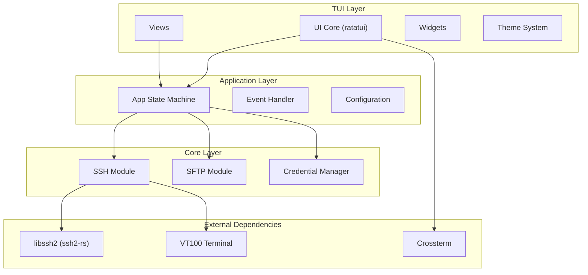
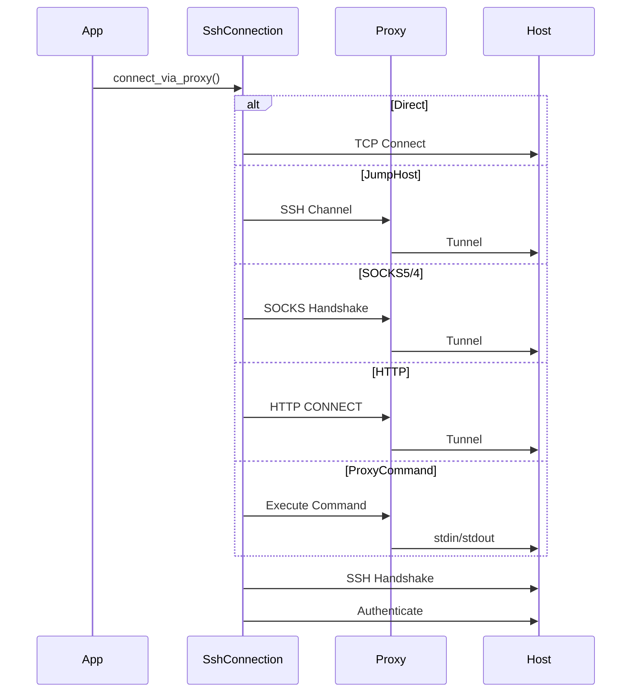
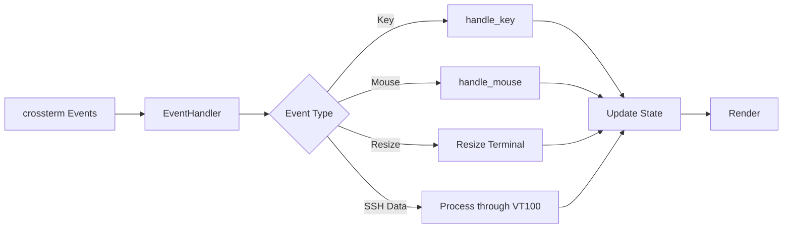

# RustySSH Architecture

A high-performance TUI SSH connection manager built in Rust, featuring a btop-inspired interface.

## System Overview



## Core Architecture

### Entry Point

The application starts in `main.rs`, which:
1. Initializes the tracing/logging subsystem
2. Creates the `App` instance
3. Runs the async main loop via Tokio runtime

### Application State (`src/app/`)

| File | Purpose |
|------|---------|
| `state.rs` | Main `App` struct - state machine, event handling, view routing |
| `events.rs` | Event types (`AppEvent`) and event handler trait |
| `mod.rs` | Module exports |

The `App` struct manages:
- Current view state (`View` enum: Connections, Session, SFTP, Tunnels, Keys, Settings, Help)
- Application running state (`AppState`: Running, Quit)
- View history stack for navigation
- SSH sessions (`SessionManager`)
- SFTP sessions (`SftpSessionManager`)
- Configuration and credentials

### Views

```
View Enum
├── Connections  → Host list, group management
├── Session      → Active SSH terminal session
├── SFTP         → Dual-pane file browser
├── Tunnels      → Port forwarding management
├── Keys         → SSH key management
├── Settings     → Application configuration
└── Help         → Keyboard shortcuts reference
```

## Module Architecture

### Configuration (`src/config/`)

| File | Purpose |
|------|---------|
| `mod.rs` | `Config` struct - loads/saves YAML configuration |
| `hosts.rs` | `HostConfig`, `AuthMethod`, `ProxyConfig`, `HostGroup`, `TunnelConfig` |
| `settings.rs` | `Settings`, `UiSettings`, `SshSettings`, `LogSettings` |

**Key Structures:**

```rust
// Authentication methods
enum AuthMethod {
    Password,           // Prompt at connect time
    KeyFile { path, passphrase_required },
    Agent,              // SSH agent
    Certificate { cert_path, key_path },
}

// Proxy configurations
enum ProxyConfig {
    JumpHost { host },       // SSH ProxyJump
    Socks5 { address, port, username?, password? },
    Socks4 { address, port, user_id? },
    Http { address, port, username?, password? },
    ProxyCommand { command },  // Custom command with %h/%p substitution
}
```

### SSH Module (`src/ssh/`)

| File | Purpose |
|------|---------|
| `connection.rs` | `SshConnection`, `ConnectionPool`, proxy handshakes |
| `session.rs` | `Session` with VT100 terminal emulation, `SessionManager` |
| `auth.rs` | Authentication handlers |
| `keys.rs` | SSH key operations |
| `tunnel.rs` | Port forwarding (local/remote/dynamic) |

**Connection Flow:**



### SFTP Module (`src/sftp/`)

| File | Purpose |
|------|---------|
| `browser.rs` | `FilePane`, `FileBrowser` - dual-pane file management |
| `sftp_session.rs` | SFTP session wrapper around ssh2::Sftp |
| `transfer.rs` | `TransferQueue` - file transfer operations |

### Credentials (`src/credentials/`)

Secure password storage system:

| File | Purpose |
|------|---------|
| `mod.rs` | `CredentialManager` - main interface |
| `master.rs` | `MasterPassword` - Argon2id hashing |
| `vault.rs` | `CredentialVault` - AES-256-GCM encrypted storage |

**Security Features:**
- Argon2id for master password hashing
- AES-256-GCM encryption for stored passwords
- OS keyring integration for master hash storage
- Zeroize for secure memory wiping

### TUI Module (`src/tui/`)

| File | Purpose |
|------|---------|
| `ui.rs` | Main render function |
| `theme.rs` | Tokyo Night color scheme |
| `icons.rs` | Nerd Font detection and fallbacks |
| `terminal_render.rs` | VT100 screen to ratatui conversion |
| `highlight.rs` | Terminal keyword highlighting |

**Views (`src/tui/views/`):**

| File | Purpose |
|------|---------|
| `connections.rs` | Host list with groups |
| `session.rs` | Active terminal session |
| `session_list.rs` | Multi-session switcher overlay |
| `sftp.rs` | Dual-pane file browser |
| `tunnels.rs` | Tunnel management |
| `keys.rs` | SSH key viewer |
| `settings.rs` | Settings editor |
| `help.rs` | Keyboard shortcuts |

**Widgets (`src/tui/widgets/`):**

| File | Purpose |
|------|---------|
| `host_list.rs` | Host entry widget |
| `status_bar.rs` | Bottom status bar |
| `find_overlay.rs` | Terminal text search overlay |

## Data Flow

### Event Loop



### Configuration Format

```yaml
settings:
  ui:
    theme: tokyo-night
    mouse_enabled: true
    scrollback_lines: 10000
  ssh:
    connection_timeout: 30
    keepalive_interval: 30

groups:
  - name: "Production"
    expanded: true
    hosts:
      - name: "web-server"
        hostname: "10.0.0.1"
        username: "admin"
        auth:
          type: agent
        proxy:
          type: jump_host
          host: "bastion-uuid-or-name"

hosts:
  - name: "personal"
    hostname: "my.server.com"
    username: "user"
    auth:
      type: password
```

## Key Dependencies

| Crate | Version | Purpose |
|-------|---------|---------|
| `tokio` | 1.x | Async runtime |
| `ratatui` | 0.26 | TUI framework |
| `crossterm` | 0.27 | Terminal manipulation |
| `ssh2` | 0.9 | SSH2 protocol (libssh2 wrapper) |
| `vt100` | 0.15 | Terminal emulation |
| `serde` + `serde_yaml` | 1.x / 0.9 | Configuration serialization |
| `argon2` | 0.5 | Password hashing |
| `aes-gcm` | 0.10 | Encryption |
| `keyring` | 2.x | OS credential storage |
